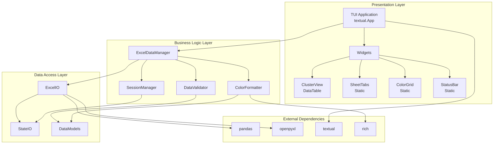
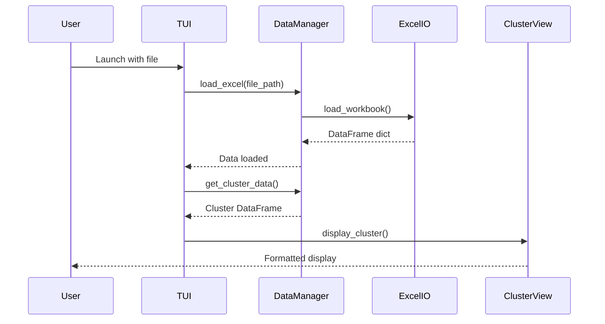
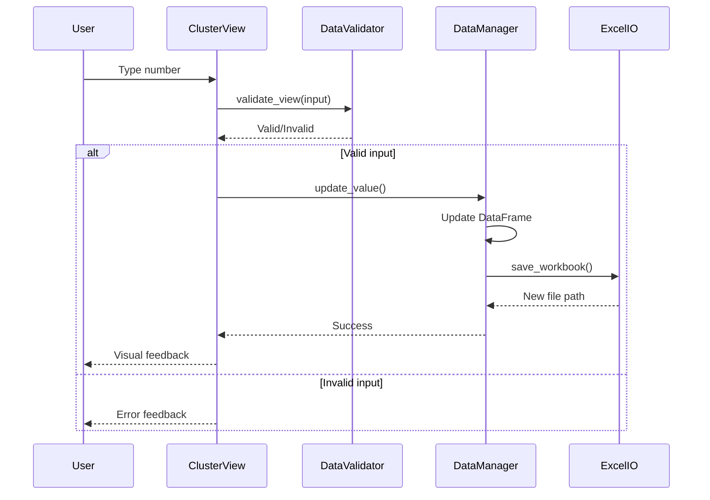

# Flow Analysis TUI Editor - Architecture Document

## Executive Summary

This document defines the architecture for a terminal-based Excel editor specifically designed for power flow constraint analysis files. The architecture prioritizes simplicity, testability, and maintainability while following the KISS principle for a single-user MVP application.

## System Architecture Overview



## Component Architecture

### 1. Presentation Layer

#### Main Application (`AnalysisTUIApp`)
- **Responsibility**: Application lifecycle, event handling, widget coordination
- **Key Methods**:
  - `on_mount()`: Initialize UI and load data
  - `handle_key_events()`: Route keyboard shortcuts
  - `update_display()`: Refresh widgets with current data
- **Dependencies**: ExcelDataManager, SessionManager

#### Widget Components

##### ClusterView Widget
- **Purpose**: Display and edit constraint data for current cluster
- **Features**:
  - Tabular display with conditional formatting
  - Inline cell editing
  - Quick number entry mode
- **Interface**:
  ```python
  class ClusterView(DataTable):
      def display_cluster(cluster_id: int, sheet_data: pd.DataFrame)
      def start_editing(initial_value: str)
      def apply_formatting(column: str, value: float) -> Style
  ```

##### SheetTabs Widget
- **Purpose**: Navigate between monthly sheets
- **Features**:
  - Visual tab indicators
  - Keyboard navigation support
- **Interface**:
  ```python
  class SheetTabs(Static):
      def set_active_sheet(sheet_name: str)
      def handle_tab_switch(direction: int)
  ```

##### ColorGrid Widget
- **Purpose**: Display date/LODF values as colored blocks
- **Features**:
  - Compact color visualization
  - Comment indicators
  - Hover tooltips
- **Interface**:
  ```python
  class ColorGrid(Static):
      def render_grid(values: List[float], comments: Dict[int, str])
      def show_comment(index: int)
  ```

### 2. Business Logic Layer

#### ExcelDataManager
- **Responsibility**: Central data management and business logic
- **Key Features**:
  - In-memory data storage
  - Edit validation
  - Auto-save coordination
- **Interface**:
  ```python
  class ExcelDataManager:
      def load_excel(file_path: str) -> None
      def get_cluster_data(sheet: str, cluster_id: int) -> pd.DataFrame
      def update_value(sheet: str, row: int, column: str, value: float) -> bool
      def save_changes() -> str  # Returns new file path
      def get_clusters_list(sheet: str) -> List[int]
  ```

#### DataValidator
- **Responsibility**: Validate user inputs according to business rules
- **Validation Rules**:
  - VIEW: Positive real numbers only (>0)
  - SHORTLIMIT: Negative numbers or empty (<0)
- **Interface**:
  ```python
  class DataValidator:
      def validate_view(value: str) -> Tuple[bool, Optional[float]]
      def validate_shortlimit(value: str) -> Tuple[bool, Optional[float]]
  ```

#### ColorFormatter
- **Responsibility**: Calculate colors based on Excel conditional formatting rules
- **Color Schemes**:
  - Core columns (VIEW, PREV, etc.): White→Yellow→Red gradients
  - RECENT_DELTA: Blue→White→Red
  - Date grids: Value-based gradients
- **Interface**:
  ```python
  class ColorFormatter:
      def get_color(column: str, value: float) -> str
      def get_gradient_color(value: float, min_val: float, max_val: float, 
                            colors: List[str]) -> str
  ```

#### SessionManager
- **Responsibility**: Persist and restore application state
- **State Elements**:
  - Current sheet
  - Current cluster
  - Row position
  - Window size
- **Interface**:
  ```python
  class SessionManager:
      def save_state(state: SessionState) -> None
      def load_state() -> Optional[SessionState]
      def clear_state() -> None
  ```

### 3. Data Access Layer

#### ExcelIO
- **Responsibility**: Handle Excel file I/O operations
- **Features**:
  - Efficient loading with pandas
  - Preserve formatting metadata
  - Timestamped saves
- **Interface**:
  ```python
  class ExcelIO:
      def load_workbook(file_path: str) -> Dict[str, pd.DataFrame]
      def save_workbook(data: Dict[str, pd.DataFrame], 
                       original_path: str) -> str
      def create_backup(file_path: str) -> str
  ```

#### StateIO
- **Responsibility**: Persist session state to JSON
- **Interface**:
  ```python
  class StateIO:
      def save_json(state: dict, file_path: str) -> None
      def load_json(file_path: str) -> dict
  ```

#### Data Models
- **Purpose**: Type-safe data structures
- **Models**:
  ```python
  @dataclass
  class SessionState:
      last_file: str
      current_sheet: str
      current_cluster: int
      current_row: int
      window_size: Tuple[int, int]
  
  @dataclass
  class EditRecord:
      timestamp: datetime
      sheet: str
      row: int
      column: str
      old_value: Optional[float]
      new_value: float
  
  @dataclass
  class ClusterInfo:
      cluster_id: int
      constraint_count: int
      cuid_list: List[str]
  ```

## Data Flow

### Read Operation Flow


### Edit Operation Flow


## File Structure

```
analysis-tui/
├── src/
│   ├── __init__.py
│   ├── app.py                 # Main TUI application
│   ├── widgets/
│   │   ├── __init__.py
│   │   ├── cluster_view.py    # ClusterView widget
│   │   ├── sheet_tabs.py      # SheetTabs widget
│   │   ├── color_grid.py      # ColorGrid widget
│   │   └── status_bar.py      # StatusBar widget
│   ├── core/
│   │   ├── __init__.py
│   │   ├── data_manager.py    # ExcelDataManager
│   │   ├── validator.py       # DataValidator
│   │   ├── formatter.py       # ColorFormatter
│   │   └── session.py         # SessionManager
│   ├── io/
│   │   ├── __init__.py
│   │   ├── excel_io.py        # ExcelIO
│   │   └── state_io.py        # StateIO
│   └── models/
│       ├── __init__.py
│       └── data_models.py     # Data structures
├── tests/
│   ├── __init__.py
│   ├── test_data_manager.py
│   ├── test_validator.py
│   ├── test_formatter.py
│   ├── test_excel_io.py
│   └── fixtures/
│       └── sample_data.xlsx
├── requirements.txt
├── pyproject.toml
├── README.md
└── project-architecture.md
```

## Design Patterns

### 1. Model-View-Controller (MVC)
- **Model**: ExcelDataManager + Data Models
- **View**: TUI Widgets (ClusterView, SheetTabs, etc.)
- **Controller**: AnalysisTUIApp

### 2. Repository Pattern
- ExcelIO acts as a repository for Excel data
- Abstracts file I/O from business logic

### 3. Observer Pattern (Simplified)
- Widgets observe data changes through app callbacks
- No complex event system for v0 simplicity

### 4. Strategy Pattern
- ColorFormatter uses different strategies per column type
- Validator uses different strategies per field

## Non-Functional Requirements

### Performance
- **Load Time**: < 5 seconds for 50MB file
  - Strategy: Load once into memory, use pandas efficiently
- **Edit Response**: < 50ms
  - Strategy: In-memory updates, batch UI refreshes
- **Save Time**: < 100ms
  - Strategy: Background save, pickle format for speed

### Testability
- **Unit Tests**: All business logic isolated from UI
- **Integration Tests**: Mock file I/O for speed
- **No UI Tests**: Manual testing for TUI interactions

### Maintainability
- **Clear Separation**: UI, Business Logic, Data Access layers
- **Single Responsibility**: Each class has one clear purpose
- **Dependency Injection**: Pass dependencies, don't create them
- **Type Hints**: Full typing for better IDE support

## Technology Stack

### Core Dependencies
```python
textual>=0.47.0      # TUI framework
rich>=13.7.0         # Color formatting
pandas>=2.0.0        # Data manipulation
openpyxl>=3.1.0      # Excel I/O
```

### Development Dependencies
```python
pytest>=7.0.0        # Testing framework
mypy>=1.0.0          # Type checking
ruff>=0.1.0          # Linting and formatting
```

## Testing Strategy

### Unit Test Coverage
- **Core Logic**: 90%+ coverage
  - DataValidator: All validation rules
  - ColorFormatter: All color calculations
  - ExcelDataManager: CRUD operations
  
### Integration Tests
- Excel loading/saving with fixtures
- Session state persistence
- Multi-sheet navigation

### Manual Testing Checklist
- [ ] Load large Excel file (>50MB)
- [ ] Navigate all sheets
- [ ] Edit VIEW values rapidly
- [ ] Verify color formatting matches Excel
- [ ] Auto-save functionality
- [ ] Session restoration

## Extension Points

### Future Enhancements (Post-MVP)
1. **Search & Filter**: Add search capability to DataManager
2. **Batch Edit**: Extend update_value to handle ranges
3. **Graphs**: Add plotext visualization widget
4. **Export**: Add CSV export to ExcelIO
5. **Undo/Redo**: Add EditHistory class with command pattern

### Plugin Architecture (Future)
- Widget plugins for custom visualizations
- Validator plugins for custom rules
- Formatter plugins for custom color schemes

## Security Considerations

### File Safety
- Always create backup before editing
- Timestamped saves prevent overwrites
- Working copy isolation

### Input Validation
- All user inputs validated before processing
- No formula evaluation (security risk)
- Path validation for file operations

## Error Handling Strategy

### Graceful Degradation
- Missing columns: Use defaults
- Invalid data: Show error, continue operation
- File errors: Detailed user feedback

### Recovery Mechanisms
- Auto-save prevents data loss
- Session state for crash recovery
- Backup files for rollback

---

## Architecture Decision Records (ADRs)

### ADR-001: Use Pandas for Data Management
**Decision**: Use pandas DataFrames for in-memory data storage
**Rationale**: 
- Excel files map naturally to DataFrames
- Efficient operations on large datasets
- Rich ecosystem for data manipulation
**Trade-offs**: Memory usage vs. performance

### ADR-002: Monolithic v0 with Clear Boundaries
**Decision**: Start with organized monolith, not microservices
**Rationale**:
- Single user application
- Faster initial development
- Clear module boundaries enable future splitting
**Trade-offs**: Simplicity now vs. scalability later

### ADR-003: No Database for v0
**Decision**: File-based persistence only
**Rationale**:
- Simplicity for single user
- Excel files are the source of truth
- JSON for lightweight state
**Trade-offs**: Performance limitations with very large files

### ADR-004: Textual Framework for TUI
**Decision**: Use Textual instead of curses/urwid
**Rationale**:
- Modern, actively maintained
- Rich widget ecosystem
- CSS-like styling
- Excellent documentation
**Trade-offs**: Larger dependency vs. better developer experience

---

*Architecture Version: 1.0*
*Last Updated: August 2025*
*Status: Ready for Implementation*